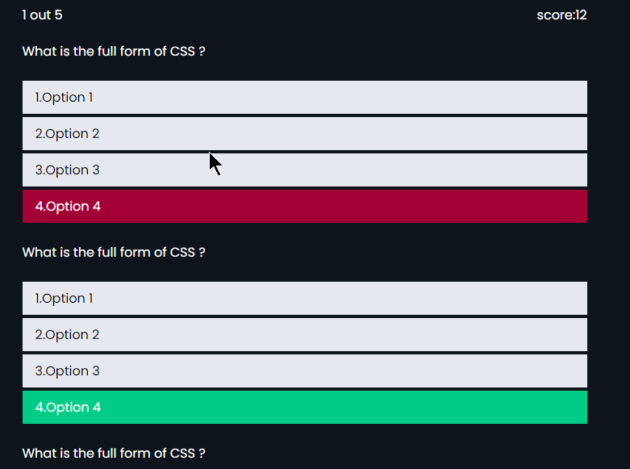

# WebQuiz
screens for the Web Quiz web app (will be integrated with React later )
[Web Quiz](https://cssjsquiz.netlify.app/)

Here are some features of the Quiz app
- It has two categories
  - JavaScript Quiz
  - CSS Quiz
By clicking any quiz category will get redirected to rule page and after acknowledging
the  rule able to take Quiz of the respective categories

Below are some of the screenshots of the screen . You can visit the live Link for visiting the site

- screenshot1
 

- screenshot2

- screenshot3

Here is the result page for the Quiz App
[Result Page](https://testing2364.netlify.app/html/resultpage/)
